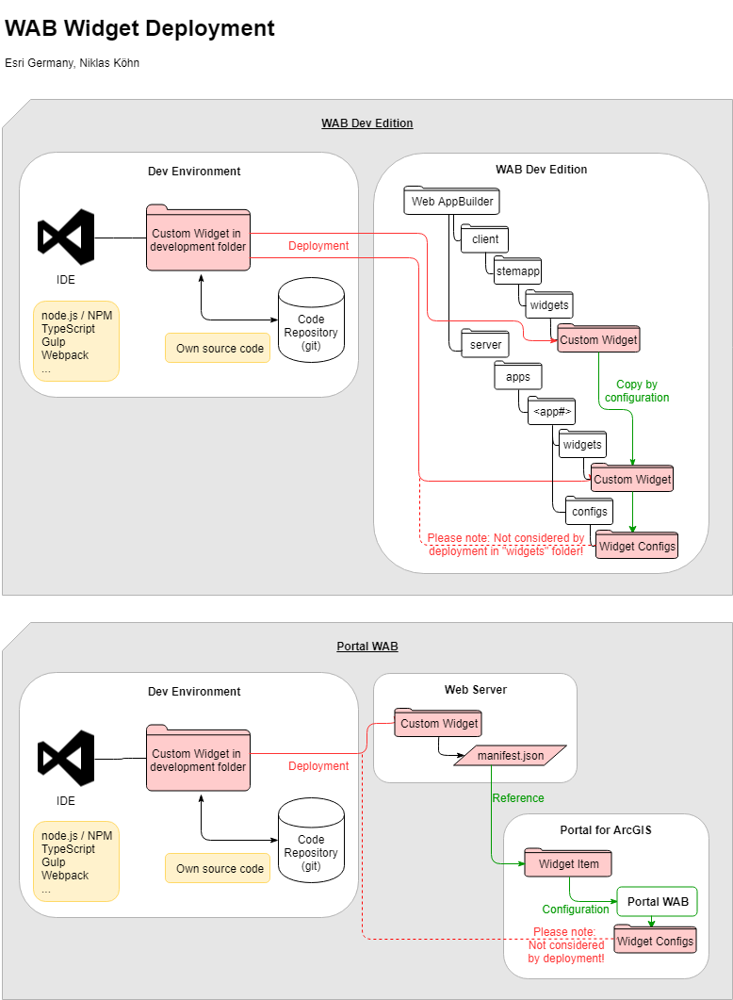

## Web AppBuilder for ArcGIS
# TypeScript Widget Templates
This repository provides setup instructions and starting points to develop widgets with TypeScript for applications based on the ArcGIS API for JavaScript in different versions, with or without the ArcGIS Web AppBuilder.

<b>Please note</b><br/>
This repository was used for developer workshops with Web AppBuilder for ArcGIS and is not anymore actively maintained. From time to time, we might update NPM packages. The Gulp tasks and config (previously used to copy the widgets into the "stemapp" and configured apps after build) are outdated, but we've added simple "build" and "watch" npm scripts to be able to compile the widgets.

## Getting started
### Installation
Checkout repository and execute ```npm install``` to install necessary node packages.

To compile, type ```npm run watch```.

### Widget deployment
Keeping your code in a separate folder an in it's own repository is quite a challenge with WAB, because we usually want to keep our sourcecode in repository. The WAB Dev Edition copies the original source code from the ``/client/widgets`` folder into your demo app folder when configuring it. At the same time, we don't wanna end up checking in the WAB jimu code. While you could solve this by checking out your code to your demo app and adding the to ``.gitignore``, you're gonna face another problem when trying to integrate several projects into one local instance of the WAB Dev Edition. we have to cover these issues:


We used to 
* create dynamic links to the source code folder or 
* create a copy job with Gulp that runs after each build. 

Our implementation is not compatible with current versions of Gulp, and we probably won't bother to update because this repo is no longer in use for customer workshops. But there's a 3rd way:
* We can solve these issues by using the npm package ``ncp`` and define come copy scripts in our ``package.json``:

```
  "scripts": {
    "start:<user>": "tsc-watch --onCompilationComplete \"npm run copy:<user>\"",
    "copy:<user>": "npm run ncp:stemapp<user> && npm run ncp:testapp<user>",
    "ncp:stemapp<user>": "ncp <widgetName> <WAB path>/client/stemapp/widgets/<widgetName>",
    "ncp:testapp<user>": "ncp <widgetName> <WAB path>/server/apps/<appId>/widgets/<widgetName>",
    ...
  }
```

Please note that the <user> part is totally optional. We've been setting up these scripts for several developers working on the same project to cover their respective local paths.


### First Build and Gulp task

This is about the deprecated Gulp part.

<s>
You should already see .JS and .JS.MAP files generated from your .TS file after running the first build: ```Ctrl-Shift B```

> **Attention VS Code users:** Gulp may fail to run in "bash" terminal. Please set another default shell for the Gulp task to execute in.

**That's it. You're good to go.**
</s>

---

## Further information

### Random notes
* We recommend using [Visual Studio Code](https://code.visualstudio.com).

### Issues
* If you VS Code terminal is set to "Git Bash", the build task may fail (```node_modules.bingulp.cmd: command not found```). Please use another shell ("Set Default Shell" and open ner terminal).
* If tasks from .vscode/tasks.json are not found after "npm install", please restart VS Code.
* gulp.dest() at the end of the compileTs job puts files into one specific folder. To keep the original relative folder structure, you have to put ```"rootDir": ""``` and ```"outDir": ""``` in your tsconfig. 

### The build task
The main build task has been defined in ```./vscode/tasks.json```. It points to a Gulp task called ```watchCompileDeploy```, which 
* builds the TypeScript files
* copies them over into the demo applications in the ```docs``` folder 
* starts BrowserSync to serve from the root directory
* starts a file watcher to build and deploy on every change

### TypeScript definitions
Definitions are interfaces of each referenced class that the TypeScript compiler uses to enable Intellisense in your IDE. Definitions for many well-known frameworks have been collected in on https://github.com/DefinitelyTyped/DefinitelyTyped. They can be downloaded and manually put into the project or installed via NPM as we do here.

### Steps taken to create this project
1. Initialize NPM
When you do this, a package.json file will be created that will contain references to the packages you install. You'll have to answer a couple of questions first: ```npm init```. From now on, installed NPM packaged will be documented in the package.json file and in the future, you'll just need to run ```npm install``` to download all dependencies. 

2. Install latest TypeScript Compiler: ```npm install typescript```

3. Initialize TypeScript Project
This creates tsconfig.json: ```tsc -init```

For ArcGIS API for JavaScript applications, please modify your **tsconfig.json** like this:
```
{
  "compileOnSave": true,
  "compilerOptions": {
    "target": "es5",
    "module": "amd",
    "sourceMap": true,
    "watch": true,
    "noImplicitAny": true,
    "strictNullChecks": true
  },
  "exclude" : ["node_modules"]
}
```

4. Initialize GIT
We recommend to start up a new GIT repository in your project folder: ```git init```

5. Create browser-readable project
If you're developing a Web AppBuilder for ArcGIS widget, you don't want to check in the WAB itself but just your widget code. The problem is now: You don't have an executable project in your repository. To see the results, you must take your widget code and place it into an app. You can use our gulp deployment task for that, as we do with the "demo" application in this repo.

#### Sample TS Coding
```
import Map = require("esri/map");
let m = new Map("mapDiv", {
    basemap: "streets",
    center: [10, 54],
    zoom: 8
});
```